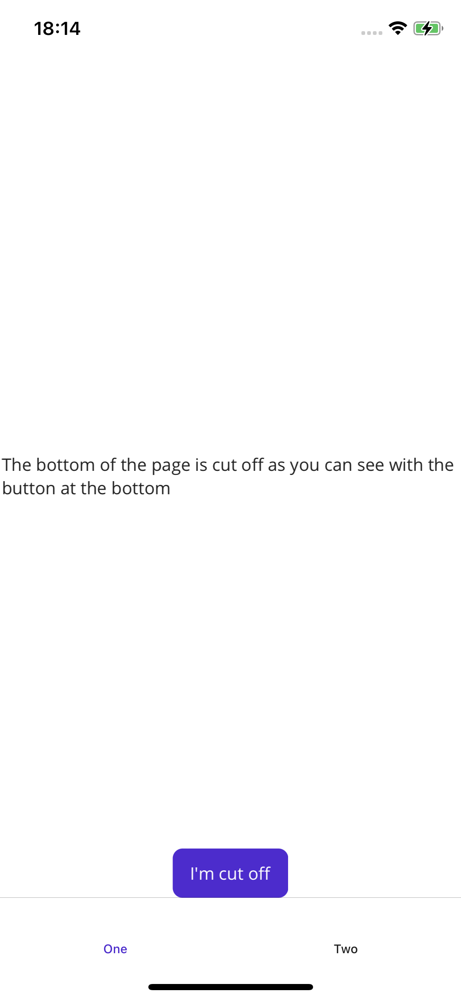
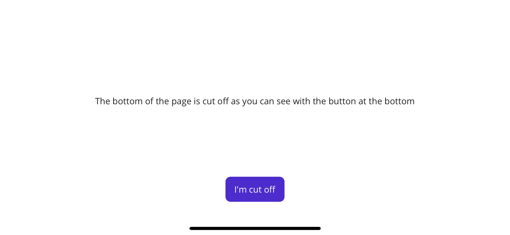
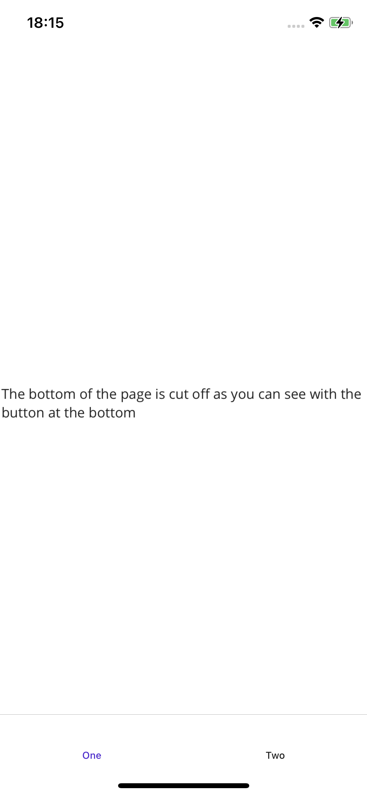

# dotnet-maui-bug-tabbar-ios-cutoff
On iOS the Shell TabBar cuts off the bottom of a ContentPage when manually setting `Shell.SetTabBarIsVisible(BindableObject obj, bool visible)` or when binding `Shell.TabBarIsVisible` to a property. It seems like there is a layout update missing when calling `Shell.SetTabBarIsVisible(this, true);`, because bottom items disappear behind the TabBar and centered elements appear lower afterwards. This indicates that the ContentPage extends behind the TabBar instead of being correctly recalculated.

**Screenshots**

Starting in Portrait, calling `Shell.SetTabBarIsVisible(this, true);` for the first time - everything is still correct:



After rotating to Landscape, calling `Shell.SetTabBarIsVisible(this, false);` - everything is still correct:



Bug: After rotating back into Portrait, calling `Shell.SetTabBarIsVisible(this, true);` for the second time - the TabBar hides the Button, which disappears behind it and the centered label now sits lower than before



**AppShell**
```xml
<?xml version="1.0" encoding="UTF-8" ?>
<Shell
    x:Class="MauiTabBarCutoff.AppShell"
    xmlns="http://schemas.microsoft.com/dotnet/2021/maui"
    xmlns:x="http://schemas.microsoft.com/winfx/2009/xaml"
    xmlns:local="clr-namespace:MauiTabBarCutoff"
    Shell.FlyoutBehavior="Disabled">

  <TabBar>
    <Tab
      Title="One">
      <ShellContent
        ContentTemplate="{DataTemplate local:MainPage}"
        Route="MainPage" />
    </Tab>
    <Tab
      Title="Two">
      <ShellContent
        ContentTemplate="{DataTemplate local:MainPage}"
        Route="MainPage" />
    </Tab>
  </TabBar>

</Shell>
```

**MainPage.xaml.cs**
```c#
namespace MauiTabBarCutoff;

public partial class MainPage : ContentPage
{
    public MainPage()
    {
        InitializeComponent();
    }

    protected override void OnSizeAllocated(double width, double height)
    {
        base.OnSizeAllocated(width, height);

        //setting this to true, then false and true again will lead to the cut-off
        Shell.SetTabBarIsVisible(this, height > width);
    }
}
```

**MainPage.xaml**
```xml
<?xml version="1.0" encoding="utf-8" ?>
<ContentPage xmlns="http://schemas.microsoft.com/dotnet/2021/maui"
             xmlns:x="http://schemas.microsoft.com/winfx/2009/xaml"
             x:Class="MauiTabBarCutoff.MainPage"
             Shell.NavBarIsVisible="False">

  <Grid
    VerticalOptions="Fill"
    HorizontalOptions="Fill">

    <Label
      Text="The bottom of the page is cut off as you can see with the button at the bottom, if you rotate into landscape and then back into portrait"
      VerticalOptions="Center"
      HorizontalOptions="Center"/>

    <Button 
      Text="I'm cut off"
      VerticalOptions="End"
      HorizontalOptions="Center"/>

  </Grid>

</ContentPage>
```
